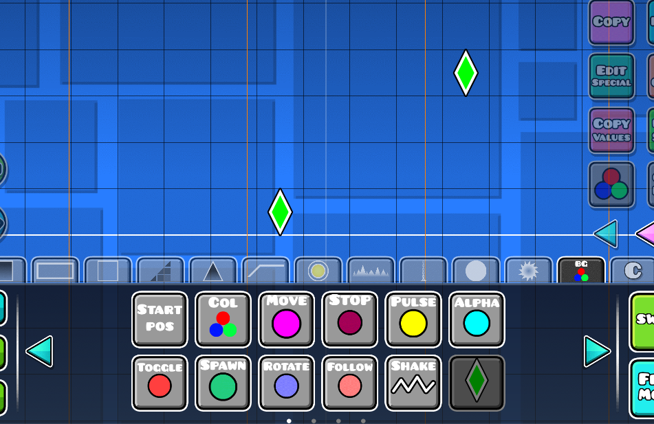
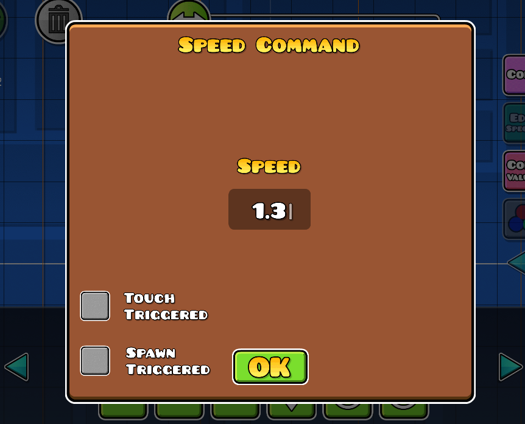
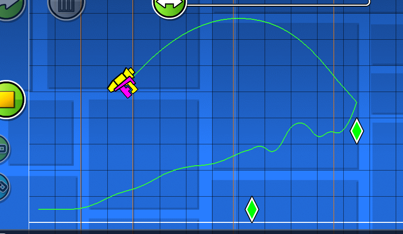

# Archived

Please go [here](https://github.com/camila314/gd-custom-object) for a much, much better implementation (that's cross-platform too).

# Fully-Functional custom object in Geometry Dash
This code is an implementation of the first completely custom trigger in GD from scratch. Code is MacOS-only but can probably be ported.

## Building
If you want to build this you need to first download the MacOSX 10.7 SDK. You can do this easily from [this repo](https://github.com/phracker/MacOSX-SDKs). Then you just need to modify the makefile to point to the correct installation path of the sdk.

## Cool example photos

# LICENSE

	The MIT License (MIT)

	Copyright Camden314 2021

	Permission is hereby granted, free of charge, to any person obtaining a 
	copy of this software and associated documentation files (the "Software"), 
	to deal in the Software without restriction, including without limitation 
	the rights to use, copy, modify, merge, publish, distribute, sublicense, 
	and/or sell copies of the Software, and to permit persons to whom the 
	Software is furnished to do so, subject to the following conditions:

	The above copyright notice and this permission notice shall be included in 
	all copies or substantial portions of the Software.

	THE SOFTWARE IS PROVIDED "AS IS", WITHOUT WARRANTY OF ANY KIND, EXPRESS 
	OR IMPLIED, INCLUDING BUT NOT LIMITED TO THE WARRANTIES OF MERCHANTABILITY, 
	FITNESS FOR A PARTICULAR PURPOSE AND NONINFRINGEMENT. IN NO EVENT SHALL THE 
	AUTHORS OR COPYRIGHT HOLDERS BE LIABLE FOR ANY CLAIM, DAMAGES OR OTHER 
	LIABILITY, WHETHER IN AN ACTION OF CONTRACT, TORT OR OTHERWISE, ARISING 
	FROM, OUT OF OR IN CONNECTION WITH THE SOFTWARE OR THE USE OR OTHER 
	DEALINGS IN THE SOFTWARE.
